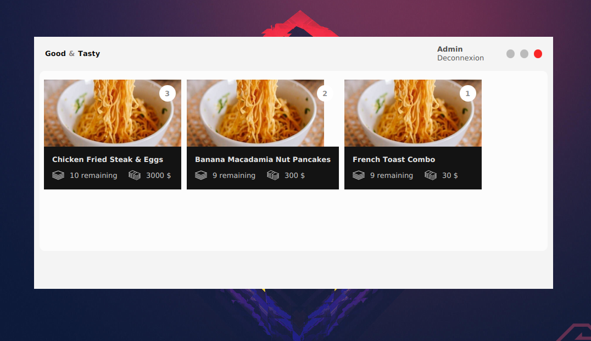

# FxComponents

A reusable javafx components collection.

## About the project

Reusing our code is a luxury in the code world. In the case of a JavaFx project, 
we would like to be able to reuse for example our beautiful login interface, 
our custom window, our product add form, ... with their animations, their behavior 
without having to rewrite everything.

We can copy the files that constitute them (our fxml and our controller) but we must 
also solve the problems of import which is still an additional annoying task and source of error.

We would like to be able to reuse our components and enjoy them without 
having to rectify anything. For example, in the case of a login component, 
we would like to be able to retrieve only the username and password and know 
if the user has clicked on the login button or not. Or display an error message 
when the information is incorrect without having to touch the view codes.

We would like to focus only on the logic of this component and not its 
behavior because others have already done it for us.

This will also allow us to divide the tasks during development. While others 
will be in charge of creating the interface itself and its behavior, 
others will be able to focus on the logic of this view like if the fields are empty, 
the error to be displayed should be this, or if the authentication information 
is wrong the error should be this.

This architecture is known as Model View ViewModel or MVVM.

So how do we make our components as reusable as possible? There are many 
solutions but in this project, I use Gradle.

By isolating each component in a Gradle project, we can isolate each component 
perfectly. The components will also be distributable in jar library.

## Want a demo?

Run the following command :
./gradlew core:run

## extract of the components currently created:

The code is open source, you can modify it to your liking.

See you soon!

